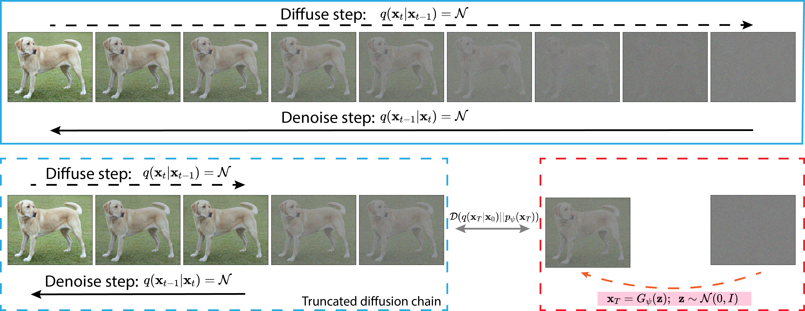
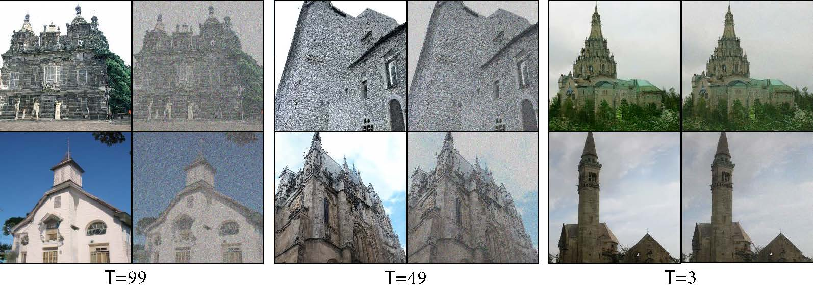

# TDPM: Truncated Diffusion Probabilistic Models

This repo contains the PyTorch implementation for [Truncated Diffusion Probabilistic Models](https://arxiv.org/abs/2202.09671)

by Huangjie Zheng, Pengcheng He, Weizhu Chen and Mingyuan Zhou.

Truncated diffusion probabilistic model is a framework that improves the diffusion-based generative models with implicit generative models such as GANs. TDPM works on a truncated diffusion chain which has much shorter length than classic diffusion models, and the truncated implicit distribution is approximated with an implicit generative model. An illustrative depiction about diffusion and truncated diffusion probabilistic models are shown in the figure below:



In the truncated diffusion probabilistic model, the implicit generative model (GAN) and diffusion models help each other to complete their own task. The diffusion process facilitate the training of GAN (with increasing T), and GAN helps the sampling efficiency of the diffusion model. Our recent paper also shows the diffusion process is able to stablize the training of GANs. Please refer to [Diffusion-GAN](https://arxiv.org/abs/2206.02262).

## About this repository
The repo currently supports the training of truncated diffusion probabilistic models. The mainbody of the code is built and modified from [DDIM](https://github.com/ermongroup/ddim).

We will keep updating this code repo for better user experience and will provide both training, and speed-up sampling scripts that enables usage with existing models like [StyleGAN2](https://github.com/NVlabs/stylegan2-ada-pytorch), [DDPM](https://github.com/pesser/pytorch_diffusion), etc. Please stay tuned. 

## Running the Experiments

### Train a model
Training can be excuted with the following command:
```
python main.py --config {DATASET}.yml --exp {PROJECT_PATH} --doc {MODEL_NAME}
```

The usage is almost the same as shown in [https://github.com/ermongroup/ddim](https://github.com/ermongroup/ddim) (the DDIM repo). 

For desired diffusion chain length, you may modify the value of variable named "truncated_timestep" in the config .yml files. 

### TDPM Efficiency
| T   | FID  | speed-up DDPM |
|-----|------|---------------|
| 999 | 3.07 | x1            |
| 99  | 3.10 | x10           |
| 49  | 3.30 | x20           |
| 3   | 3.41 | x250          |
| 1   | 4.47 | x500          |
| 0   | 8.91 | x1000         |




## References

If you find the code useful for your research, please consider citing
```bib
@article{zheng2022truncated,
  title={Truncated Diffusion Probabilistic Models},
  author={Zheng, Huangjie and He, Pengcheng and Chen, Weizhu and Zhou, Mingyuan},
  journal={arXiv preprint arXiv:2202.09671},
  year={2022}
}
```

## Acknowledgements

This implementation is based on / inspired by:

- [https://github.com/ermongroup/ddim](https://github.com/ermongroup/ddim) (the DDIM repo), 
- [https://github.com/NVlabs/stylegan2-ada-pytorch](https://github.com/NVlabs/stylegan2-ada-pytorch) (PyTorch implementation of stylegan2, here we do not activate the adaptive augmentation).
